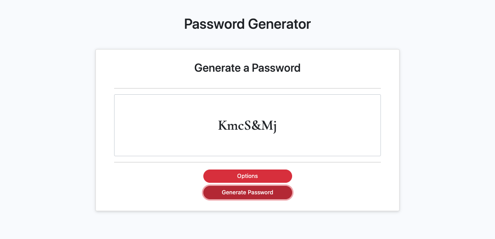

# Password Generator

## Description

- A password generator which provides options to manipulated the complexity of the returned password

### The User Story for this project is as follows:
- An employee with access to sensitive data wants to randomly generate a password that meets certain criteria so that they can create a strong password that provides greater security

### The codebase meets the general criteria for acceptance:
- When I desire to change the password criteria, then I am able to select which criteria to include in the password
- When I desire to change the length of the password, then I am able to choose a length of at least 8 characters and no more than 128 characters
- When I desire, I may choose lowercase, uppercase, numeric, and/or special characters
- When my choices are finalized, then my input should be validated and at least one character type should be selected
- When desired criteria is selected, then a password is generated that matches the selected criteria
- When the password is generated the password is written to the page

### Installation
- Deployed application may be seen: [here](https://sourslaw.github.io/03_Password_Generator/)

### License
- Licensed under the [MIT](https://opensource.org/licenses/mit-license.php) license.